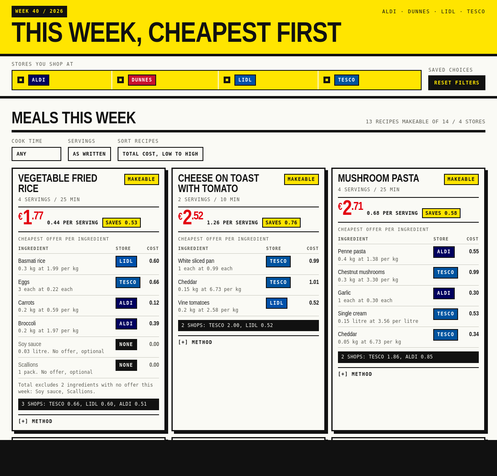

# Smart Eats Ireland

See what you can cook this week from whatever is cheapest across Aldi, Dunnes
Stores, Lidl and Tesco.



Meals first, each with a cost per serving and which shop every ingredient
comes from. Pick the shops you actually use and everything re-prices against
them.

Below that, the offers themselves. A yellow label marks the cheapest offer for
its ingredient this week.

Installable, and works offline once loaded.

## Run it

```bash
python3 -m http.server 8080
```

Open `http://localhost:8080`.

No build step and no dependencies.

## Docs

- [Architecture](wiki/architecture.md)
- [Data](wiki/data.md)
- [Roadmap](wiki/roadmap.md)

---

Sample data. The prices are illustrative and are not real store prices. Not
affiliated with Aldi, Dunnes Stores, Lidl or Tesco.

MIT licensed.
