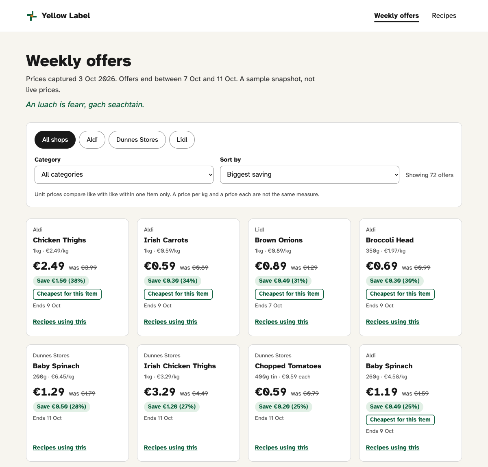

# Yellow Label

See what is cheapest across Aldi, Dunnes Stores, Lidl and Tesco this week, and what
you can cook with it.



Filter the week's offers by shop and category, then see the recipes they
make, each costed per serving with the shop each ingredient comes from. A
recipe page scales to the number of servings you need and shows what the full
packs cost at the till.

Installable, and works offline once loaded.

## Run it

```bash
python3 -m http.server 8080
```

Open `http://localhost:8080`.

No build step and no dependencies.

## Docs

- [Architecture](wiki/architecture.md)
- [Data](wiki/data.md)
- [Roadmap](wiki/roadmap.md)

---

Sample data. The prices are illustrative and are not real store prices. Not
affiliated with Aldi, Dunnes Stores or Lidl.

MIT licensed.
