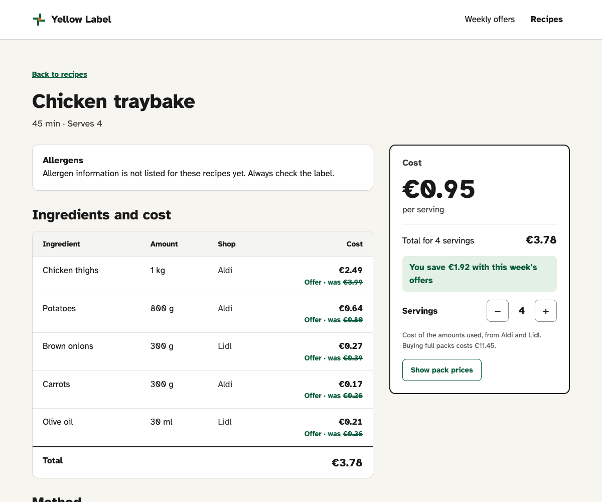

# Data

Three files in `data/`, joined by `ingredientKey`.

The prices are illustrative sample data, not real store prices. See
[Roadmap](roadmap.md) for what a live source would take.



## Current set

| | |
| --- | --- |
| Ingredients | 41, of which 38 have an offer |
| Offers | 72 across three shops |
| Recipes | 14, of which 13 are makeable |

Two gaps are deliberate, so the matching rule is visibly doing work rather
than always saying yes:

- `prawn_raw` has no offer and is essential to the garlic prawn pasta, so that
  recipe is not makeable and sorts last.
- `soy_sauce` and `scallion` have no offer and are both non essential in the
  vegetable fried rice, so it stays makeable with two missing optional lines.

## `ingredients.json`

The controlled vocabulary. Every key used anywhere else must exist here.

```json
{
  "chicken_thigh": { "label": "Chicken thighs", "category": "protein", "unit": "kg" }
}
```

Keys are snake case. `unit` is one of `kg`, `litre`, `each` or `pack`, and it
determines what `unitPrice` means for every offer on that ingredient.

## `offers.json`

```json
{
  "week": "2026-W40",
  "capturedAt": "2026-10-03",
  "source": "seed",
  "currency": "EUR",
  "offers": [
    {
      "id": "aldi-chicken-thigh-1kg",
      "store": "ALDI",
      "ingredientKey": "chicken_thigh",
      "name": "Chicken Thighs",
      "size": "1kg",
      "price": 2.49,
      "wasPrice": 3.99,
      "unitPrice": 2.49,
      "unitLabel": "per kg",
      "validTo": "2026-10-09"
    }
  ]
}
```

- `store` is `ALDI`, `DUNNES` or `LIDL`.
- `wasPrice` is null when there is no previous price. 20 of the 72 offers have
  none, so they score a saving of zero.
- `source` must say `seed` unless the data genuinely came from a live read.
  The interface reads this to decide whether to show the snapshot notice.

## `recipes.json`

```json
{
  "generatedAt": "2026-10-03",
  "recipes": [
    {
      "id": "chicken-traybake",
      "title": "Chicken traybake",
      "servings": 4,
      "minutes": 45,
      "ingredients": [
        { "ingredientKey": "chicken_thigh", "qty": 1, "unit": "kg", "essential": true }
      ],
      "steps": ["Heat oven to 200C."]
    }
  ]
}
```

`unit` on a recipe ingredient must match the vocabulary's unit for that key.
At least one ingredient must be `essential`, or the recipe is trivially
makeable and means nothing.

## Validating

```bash
node data/validate.mjs
node scripts/check
```

Both exit non zero on failure.

`data/validate.mjs` checks the contract field by field, the writing rules
across every string in the three files, and then costs the whole recipe bank
and asserts at least one recipe is makeable. It prints every recipe costed,
cheapest per serving first.

It also checks the costing helpers: cost per serving holds at 1 to 12
servings, the lines add up to the total, and full packs cover the amount
used and never cost less.

`scripts/check` covers the same contract plus the writing rules over the
code, and fails a stylesheet that sets a raw colour instead of using the
tokens in `styles/tokens.css`.

The validator was negative tested: eight faults were seeded into a scratch
copy of the data and all eight were caught. A pass only means something when
a fail is reachable.

## Changing the data

Edit the JSON and run both validators. Two things are easy to get wrong:

**Adding an ingredient.** Add it to `ingredients.json` first. A key used in an
offer or recipe but missing from the vocabulary fails validation, which is the
point: without that check a typo would silently stop a recipe matching.

**Pack sizes.** `unitPrice` must agree with `size` and with the vocabulary's
unit. A 3 pack of garlic at 0.89 is `0.30` per each, not `0.89`.
